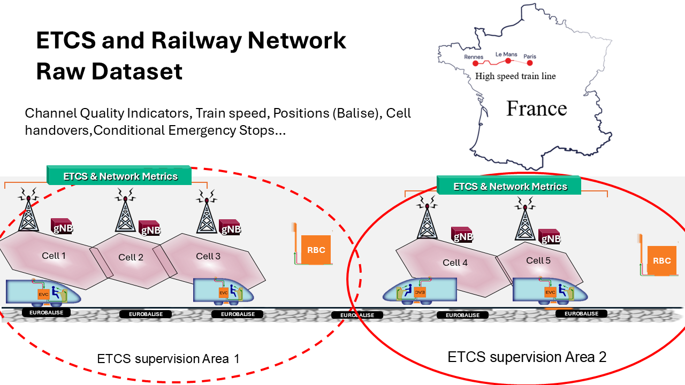
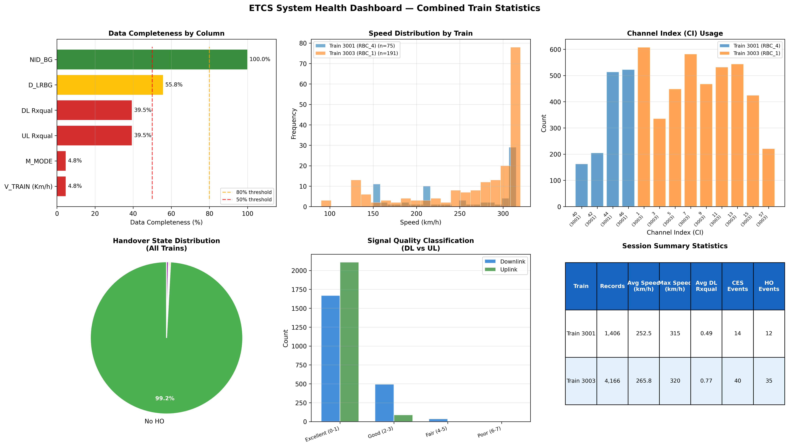

# ETCS and Railway Network Raw Dataset

This repository contains the raw dataset release for **ETCS and Railway Network Raw Dataset**:

<https://ieee-dataport.org/documents/etcs-and-railway-network-raw-dataset>

## Abstract

The ETCS (European Train Control System) and Railway Network Raw Dataset is a raw railway communication and operation dataset collected from the private network of the French National Railways operator (SNCF) and intended to support research on intelligent railway networking, ETCS-aware communications, mobility management, and data-driven railway system optimization. The dataset contains heterogeneous observations collected over one week on the BPL high-speed railway line in eastern France, covering approximately 180 km and 107 observed trains, with an average sampling interval of 250 ms. It includes railway and communication-related information such as channel quality indicators, train speed, balise train positions, cell handovers, and conditional emergency stop events, enabling the joint study of train operations and wireless network behavior in ETCS-supervised environments. To preserve confidentiality, the released raw version excludes private and sensitive information and includes anonymized data only. The dataset is suitable for applications such as railway network slicing, mobility prediction, handover analysis, radio resource management, anomaly detection, reliability assessment, and AI/ML-based optimization for future railway communication systems. As a raw dataset, it preserves the original measurement scale and missing-data patterns to allow researchers to apply their own preprocessing and modeling strategies for different use cases.

## Overview

This dataset:

- covers approximately **one week** of observations on the **BPL high-speed railway line** in eastern France
- spans approximately **180 km**
- includes **107 observed trains**
- has an average sampling interval of about **250 ms**
- combines railway-operation and communication information in a single raw dataset
- preserves original measurement scale and missing-data patterns to support different downstream preprocessing strategies

The released raw version excludes private and sensitive information and contains anonymized data only.

## Included Data

This package contains:

- `Raw_BPL/`: the main raw data directory
- `BPL_Dataset_feature_dictionary.csv`: feature descriptions and units
- `ETCS_dataset.png`: dataset overview image
- `Data_Visualization_dashboard.png`: dashboard-style visualization image

Based on the local package, the repository currently contains:

- `409` CSV trace files
- `44` XLSX call trace files
- a train-oriented folder structure with `107` observed train folders

## Data Content

The dataset includes railway and communication-related information such as:

- channel quality indicators
- train speed
- balise train positions
- cell handovers
- conditional emergency stop events

From the included feature dictionary and sample files, the core tabular fields include:

- `Timestamp`
- `CI`
- `V_TRAIN (Km/h)`
- `NID_BG`
- `M_MODE`
- `DL Rxqual`
- `UL Rxqual`
- `D_LRBG`
- `HO_state`
- `CES`
- `EStop`

## Folder Structure

```text
Raw_BPL_RailNet/
├── README.md
├── BPL_Dataset_feature_dictionary.csv
├── ETCS_dataset.png
├── Data_Visualization_dashboard.png
└── Raw_BPL/
    ├── train3000/
    │   └── 0110/
    │       └── RBC_*.csv
    ├── train3001/
    ├── ...
    └── train3106/
```

The `Raw_BPL` tree is organized by train identifier and acquisition subfolder. The package contains both RBC CSV traces and call trace spreadsheets.

## Example Applications

The IEEE DataPort record highlights the following application areas:

- railway network slicing
- mobility prediction
- handover analysis
- radio resource management
- anomaly detection
- reliability assessment
- AI/ML-based optimization for future railway communication systems

## Visuals

### Dataset Overview



### Visualization Dashboard



## Notes for Users

- This is a raw dataset release.
- Missing values are intentionally preserved.
- Users can apply their own cleaning, interpolation, feature engineering, and modeling pipelines depending on the target task.
- The feature dictionary file provides the recommended interpretation of each published field.

## Citation

If you use this dataset, please cite:

```text
David KULE MUKUHI, Fawzi KHOURI, Rodrigue Fargeon, Leo Mendiboure,
Rami Langar, Sylvain Cherrier, Marion Berbineau, and Pierre-Yves Petton.
ETCS and Railway Network Raw Dataset. IEEE Dataport, 2026.
https://dx.doi.org/10.21227/zsea-tm03
```

BibTeX:

```bibtex
@data{zsea-tm03-26,
  doi = {10.21227/zsea-tm03},
  url = {https://dx.doi.org/10.21227/zsea-tm03},
  author = {David KULE MUKUHI and Fawzi KHOURI and Rodrigue Fargeon and Leo Mendiboure and Rami Langar and Sylvain Cherrier and Marion Berbineau and Pierre-Yves Petton},
  publisher = {IEEE Dataport},
  title = {ETCS and Railway Network Raw Dataset},
  year = {2026}
}
```
